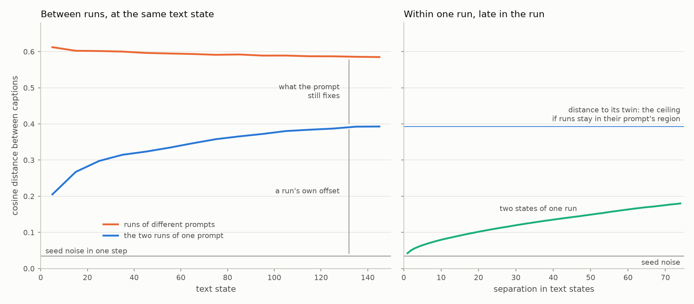
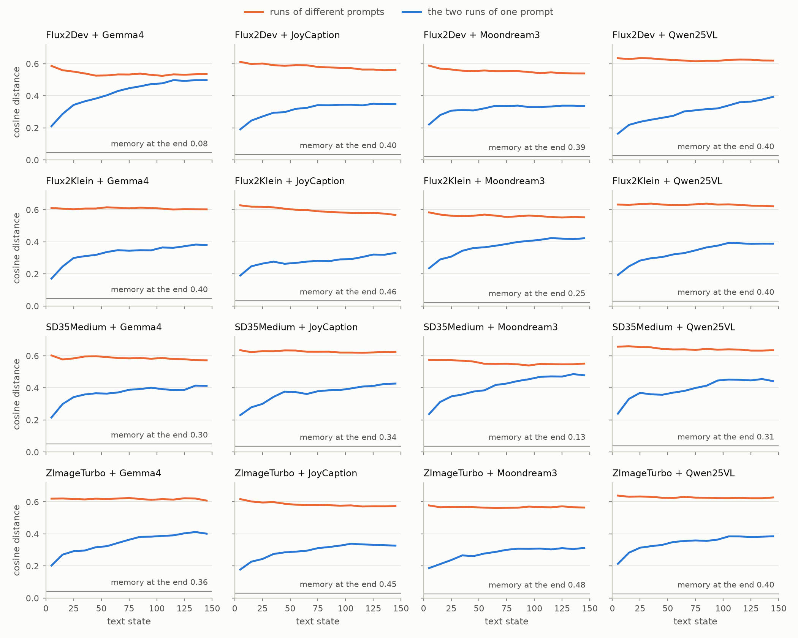
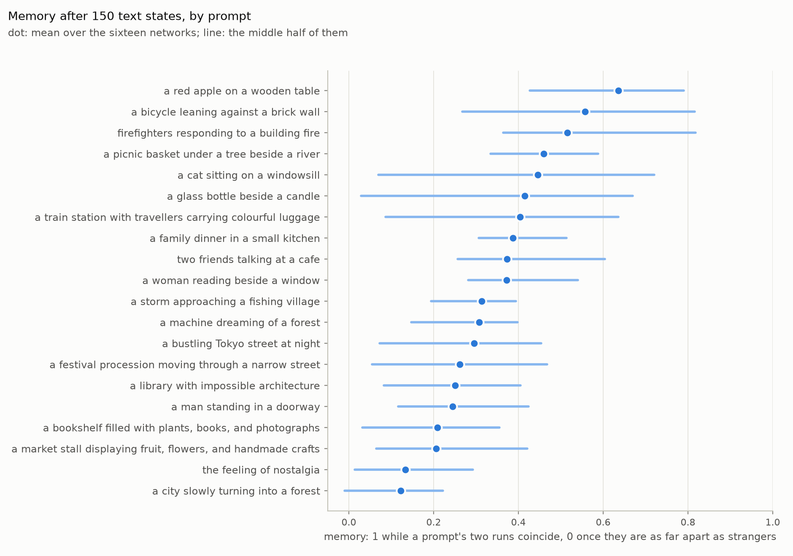
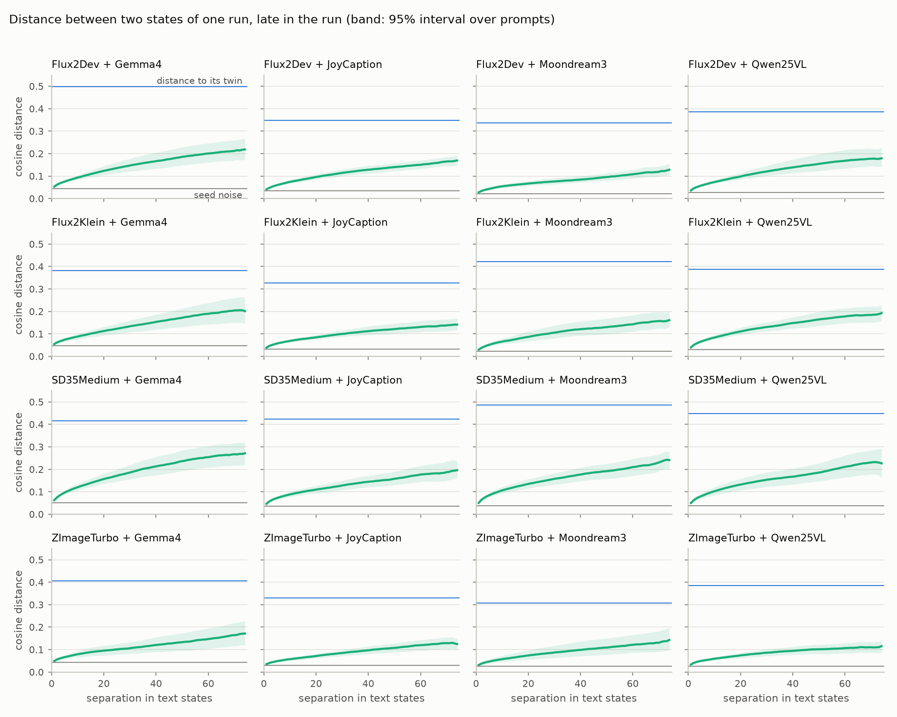
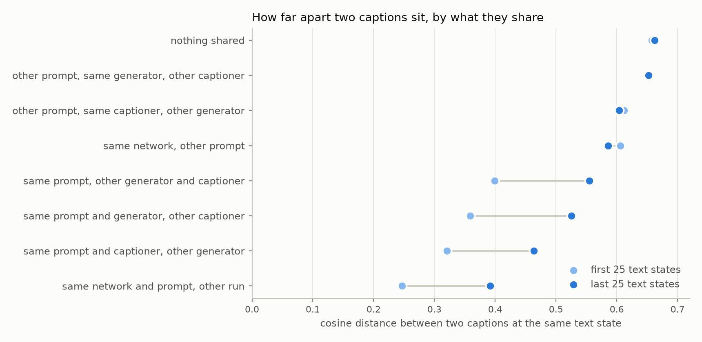
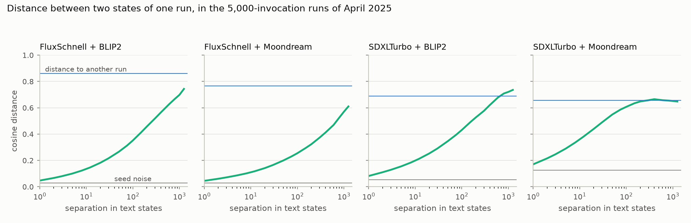

# How the loop moves: seed noise, a run's own offset, and what the prompt fixes

Written 2026-10-04 for TASK-103, on TASK-90's panel (experiment `01a09e21`: 16
networks, 20 prompts, two runs per prompt, 150 text states per run). Measured
with `analysis/drift_memory.py` and `analysis/seed_resample.py`; the numbers
are in the JSON beside each and the figures in `analysis/drift_memory/`.
`panel-audit.md` is the check that the data underneath is sound.

This replaces the Markov state model (TASK-76). The panel has no states that
runs both share and cross, so there was nothing for a transition matrix to
count. The brief for what replaces it was the simplest formalism that explains
what the runs are seen to do.

## The description

A caption's embedding at a text state is three things added together:

    position = where its prompt sits in this network
             + the run's own offset from there
             + noise from the last diffusion seed

Each part has a size, and the sizes come straight off distances between
embeddings. The embeddings are unit vectors, so cosine distance is half the
squared Euclidean distance and adds the way a variance does. Every quantity
below is a mean cosine distance or the difference of two. Nothing is clustered
or partitioned, and there is no lag to choose.

The left panel shows all three parts. Two captions from runs of different
prompts (strangers) sit 0.59 apart, and that barely changes over a run. The two
runs of one prompt (twins) start 0.21 apart, and by the end they are 0.39
apart. Underneath both is the 0.034 that a single seed draw contributes. So at
the end of a run:

| Part | Size | Read off |
| --- | --- | --- |
| seed noise | 0.034 | the part of a step the next step takes back |
| a run's own offset | 0.36 | twin distance less the noise |
| what the prompt fixes | 0.19 | stranger distance less twin distance |

Memory is the last row as a share of the last two. It is 1 while a prompt's two
runs coincide and 0 once they are as far apart as strangers. Over the first ten
text states it is 0.71, and over the last twenty 0.35.

The right panel is the same run compared with itself. Two states of one run are
further apart the longer the gap between them. At a gap of seventy states they
are 0.18 apart, still short of the 0.39 to the twin.

### Definitions

`D(k)` is the mean distance between two states of one run that are `k` text
states apart, taken from state 75 on. Twin and stranger distances are between
runs at the same text state, in bins of ten states.

| Quantity | How it is computed |
| --- | --- |
| noise | `2 D(1) - D(2)` |
| what accumulates in a step | `D(1)` less the noise |
| a run's own offset | twin distance less the noise |
| what the prompt fixes | stranger distance less twin distance |
| memory | what the prompt fixes, over stranger distance less the noise |
| accumulated displacement | `D(k)` less the noise |
| shared movement | distance from one twin early to the other twin late, less the mean of the twin distances at the two times |

Intervals resample the twenty prompts, with the same resample applied to every
network.

## What the panel shows

### A step is four-fifths seed noise

The mean distance between consecutive captions late in a run is 0.042. Suppose
a caption is a slow part moving by independent increments, plus fresh noise at
every step. Then one step is `w/2 + s` and two steps are `w + s`. The noise `s`
is twice the one-step distance less the two-step distance. That comes to 0.034,
which is 80% of a step. In every one of the sixteen networks it is between 73%
and 87%. What accumulates is 0.008 per step.

TASK-89 reached the same reading by a direct route. It redrew captions taken
from pilot images at several seeds, and the scatter between redraws was
89--107% of a settled step in the old 200-step runs. The direct check on the
panel's own steps is
`analysis/seed_resample.py`, which redraws one late step of every network at a
new seed. If a step is an increment plus fresh noise, two redraws of one
caption should sit as far apart as two steps of the stored run. That result is
not in this document yet; TASK-103 says how to fold it in.

This is why the runs look busier than they are. Most of the difference between
one caption and the next is detail that the generator redraws at every step,
and none of it carries forward.

### A run moves away from its twin and then nearly stops

Twins start from the same prompt, so the distance between them is what each
run's own history has added. Less the noise, it is 0.16 over the first ten
states and 0.36 over the last twenty. Most of that opens early. Over the last
fifty states the twin distance is still rising, by 0.034 per hundred states on
average. In fourteen of the sixteen networks the interval on that slope
includes zero.

### The prompt still fixes a third of where a run sits

Memory falls from 0.71 to 0.35 and the fall has almost stopped: 0.36 at states
110--129, 0.35 at 130--149. At the rate of the last fifty states, the twins
would reach the stranger distance after about another 570 text states. The
rate has been falling throughout, so 570 is a lower bound on any horizon that
would show a prompt forgotten.

Networks differ. Fourteen of them end between 0.25 and 0.48. Two have nearly
lost the prompt: Flux2Dev + Gemma4 at 0.08, whose interval includes zero, and
SD35Medium + Moondream3 at 0.13.

Prompts differ by more than networks do. Averaged over the networks, memory at the end is 0.64 for
"a red apple on a wooden table". For "a city slowly turning into a forest" it
is 0.12. Single objects are at the top, and the abstraction and the
transformation are at the bottom. The middle is not all where one would guess:
"a man standing in a doorway" is fifth from last.

Across the 320 prompt-and-network pairs, the prompt accounts for 18% of the
variation in end-of-run twin distance and the network for 10%. The rest
belongs to the pair itself, which is a single twin distance and therefore
noisy.

### Runs from different prompts do not converge

The stranger distance falls from 0.612 to 0.585 over a run, a 4% drop. In
eleven networks the interval on that change includes no change at all. The
other five are three of the four Flux2Dev networks and three of the four
JoyCaption ones, one network being both. Each is down 6--8%.

This is the test of the claim that these loops converge on generic motifs
whatever they start from (Hintze et al., Patterns 2025). At 150 text states
the panel shows at most the beginning of that, and only in networks that
include Flux2Dev or JoyCaption.

### Within a run, displacement is still growing

Late in a run, two of its states 70 apart are 0.175 apart, which less the noise
is 0.14 of accumulated displacement. In all sixteen networks it is still
growing at the longest separations the run allows. The accumulated displacement
at separations of 60--74 is 1.27--1.59 times what it is at 30--44. A plateau
would give 1 and a random walk 1.8.

If a run stays inside the region its prompt gives it, the ceiling on this
displacement is the run's own offset. Two states of one run, once they share
nothing but the prompt, are in the position of two independent runs of that
prompt. Against that ceiling the runs have covered 39% in seventy states
(23--59% by network).

Were the approach exponential, it would have a time constant of about 145 text
states, 80 to 260 by network. It is not exponential, since movement is faster
early in a run than late. The figure says only that the slow part of a run
takes about the run's own length to play out. Whether the displacement does
level off at the twin distance is what 150 states cannot show. The old
5,000-invocation runs, below, are long enough to see it happen.

Movement slows as a run ages. Two states 25 apart are 0.186 apart when the
first of them falls in the first 25 states of a run. For each later block of 25
the figure is 0.141, 0.126, 0.116 and 0.106. The settled figures above are
taken from state 75 on for that reason.

### Twins move together early and separately late

How far the two runs of a prompt move together can be measured. Take the
distance from one twin early to the other twin late, less the mean of the twin
distances at the two times. Over the first seventy states, 24% of a run's
displacement is shared with its twin. By network that is 11--35%, and above
zero in all sixteen. Between states 80 and 145 it is 4%, with an interval that
includes zero in thirteen networks.

A prompt has somewhere it goes in a given network, and both its runs head
there early on. After that, each run's movement is its own.

### The runs of a network are not alike

The averages cover runs that behave very differently. Compare a run's mean
position over states 75--79 with its mean over its last five. By that measure
43 of the 640 runs have not moved beyond what noise alone would put between
two such means. Another 167 have moved more than a third of the stranger
distance. ZImageTurbo has the most runs that stay put (27 of its 160) and
SD35Medium the most that travel (67 of its 160).

### What the generator sets and what the captioner sets

The table gives how much further apart two captions sit when they differ in
one thing, over and above the distance between twins. That distance is 0.25
over the first 25 states and 0.39 over the last.

| Swap | First 25 states | Last 25 states |
| --- | --- | --- |
| the prompt | 0.36 | 0.19 |
| the generator | 0.07 | 0.07 |
| the captioner, as embedded | 0.11 | 0.13 |
| the captioner, its mean vector removed | 0.06 | 0.07 |

A different captioner writes differently whatever the image, and an embedding
picks that up. Removing each captioner's mean vector takes out its way of
writing, and what is left is the same size as swapping the generator. On this
measure the two halves of the loop count about equally towards where a caption
ends up, and both count for much less than the prompt.

They set different things about how a caption moves. Across the four-by-four
panel:

| Quantity | Range over networks | Generator | Captioner | Both together |
| --- | --- | --- | --- | --- |
| seed noise | 0.022--0.050 | 19% | 75% | 6% |
| what accumulates per step | 0.005--0.013 | 78% | 12% | 11% |
| a run's own offset at the end | 0.28--0.45 | 31% | 18% | 51% |
| memory at the end | 0.08--0.48 | 28% | 22% | 50% |

The captioner sets the noise: 0.046 with Gemma4, 0.027 with Moondream3. The
generator sets how much of a step is kept: 0.012 with SD35Medium, 0.006 with
ZImageTurbo. Those two shares are well determined. Resampling prompts leaves
the captioner with 64--81% of the noise and the generator with 59--84% of what
is kept.

Memory and offset belong to the pairing more than to either model. With
sixteen networks and no replication, the intervals on those shares run from
near zero to over a half. The panel cannot say more than that.

## By network

Run offset and prompt gap are at the end of the run. Reached is the
accumulated displacement at a separation of seventy states, as a share of the
run offset. Static and mobile count runs out of 40.

| Network | Step | Noise share | Accumulates per step | Run offset | Prompt gap | Memory (95% interval) | Reached | Static | Mobile |
| --- | --- | --- | --- | --- | --- | --- | --- | --- | --- |
| Flux2Dev + Gemma4 | 0.053 | 0.85 | 0.008 | 0.45 | 0.04 | 0.08 (-0.04--0.19) | 37% | 1 | 15 |
| Flux2Dev + JoyCaption | 0.041 | 0.84 | 0.006 | 0.31 | 0.21 | 0.40 (0.31--0.48) | 41% | 1 | 8 |
| Flux2Dev + Moondream3 | 0.028 | 0.79 | 0.006 | 0.31 | 0.20 | 0.39 (0.29--0.50) | 31% | 1 | 4 |
| Flux2Dev + Qwen25VL | 0.036 | 0.75 | 0.009 | 0.36 | 0.24 | 0.40 (0.27--0.52) | 41% | 0 | 9 |
| Flux2Klein + Gemma4 | 0.054 | 0.86 | 0.008 | 0.34 | 0.22 | 0.40 (0.26--0.55) | 46% | 6 | 12 |
| Flux2Klein + JoyCaption | 0.039 | 0.82 | 0.007 | 0.30 | 0.25 | 0.46 (0.34--0.57) | 36% | 0 | 5 |
| Flux2Klein + Moondream3 | 0.030 | 0.74 | 0.008 | 0.40 | 0.13 | 0.25 (0.14--0.36) | 33% | 0 | 9 |
| Flux2Klein + Qwen25VL | 0.040 | 0.74 | 0.010 | 0.36 | 0.23 | 0.40 (0.24--0.53) | 43% | 0 | 12 |
| SD35Medium + Gemma4 | 0.062 | 0.81 | 0.012 | 0.37 | 0.16 | 0.30 (0.19--0.42) | 59% | 1 | 22 |
| SD35Medium + JoyCaption | 0.046 | 0.78 | 0.010 | 0.39 | 0.20 | 0.34 (0.17--0.50) | 39% | 3 | 12 |
| SD35Medium + Moondream3 | 0.050 | 0.73 | 0.013 | 0.45 | 0.07 | 0.13 (0.01--0.26) | 43% | 1 | 18 |
| SD35Medium + Qwen25VL | 0.050 | 0.77 | 0.012 | 0.41 | 0.18 | 0.31 (0.17--0.46) | 46% | 2 | 15 |
| ZImageTurbo + Gemma4 | 0.049 | 0.87 | 0.006 | 0.36 | 0.21 | 0.36 (0.22--0.50) | 33% | 9 | 7 |
| ZImageTurbo + JoyCaption | 0.035 | 0.85 | 0.005 | 0.30 | 0.24 | 0.45 (0.34--0.56) | 32% | 3 | 8 |
| ZImageTurbo + Moondream3 | 0.031 | 0.81 | 0.006 | 0.28 | 0.26 | 0.48 (0.34--0.61) | 38% | 9 | 8 |
| ZImageTurbo + Qwen25VL | 0.033 | 0.79 | 0.007 | 0.36 | 0.24 | 0.40 (0.25--0.55) | 23% | 6 | 3 |

## What is counted separately

Two kinds of run fall outside the description, and every number above includes
them.

### Runs that freeze

A caption that repeats exactly from one text state to the next is a step in
which nothing moved at all. Late in the run that is 8.6% of steps in Flux2Dev +
Moondream3, 5.0% in ZImageTurbo + Moondream3 and 3.3% in Flux2Klein +
Moondream3. Everywhere else it is 1.5% or less. It goes with the captioner
that writes the shortest captions, as `long_horizon_baseline.py` found on the
old data. After state 75, 134 runs repeat a caption at least once, and three
repeat for more than half of it.

### Runs that simplify

Three runs slide into a flat field of one colour: one black, two lime green,
all with Gemma4. Seven spend a third or more of their length on images with
almost nothing in them, such as a white-to-black gradient or a black half
beside a red half. Five of those seven are Flux2Dev runs and five are Gemma4
runs. `panel-audit.md` lists them and how each got there.

They move the averages very little. Leaving out the prompts with such a run
changes memory at the end by 0.02 at most in the three networks that have
them. Flux2Dev + Gemma4 goes from 0.08 to 0.10, so its low memory is not their
doing.

## What it explains and what it does not

Watching the runs, the description accounts for:

- captions and images that change at every step without the run going anywhere
  (the noise)
- a run that is still recognisably about its prompt after 300 invocations (the
  prompt gap)
- two runs of a prompt that end up as different pictures of related things (the
  offset)
- an apple that stays an apple while nostalgia goes anywhere (memory by prompt)
- SD35Medium runs that keep travelling and ZImageTurbo runs that sit still
  (what the generator keeps of a step)

It does not account for:

- How a run moves, as distinct from how far. A run that holds a scene for sixty
  states and then changes it, and one that changes a little at every step, can
  have the same displacement curve. The distance between a run's mean over five
  states and over the next five is skewed: its mean is 1.3 to 1.8 times its
  median in every network. Jumps are part of the movement, then, and nothing
  here separates them from steady drift.
- Where runs go. The Flux2Dev + Gemma4 network ends most of its runs in
  high-contrast red and black. A person sees that at once; here it shows only
  as the lowest memory in the panel.
- The runs that simplify, which are counted but not predicted.
- Anything about the images. Only captions are embedded.

## What the old 5,000-invocation runs add

The project has one dataset deep enough to see where the displacement curve
goes: 128 runs of 2,500 text states from April 2025, measured the same way by
`analysis/long_run_drift.py`. It is a different loop in every respect that
affects the numbers. The models are older and the captions are ten to
twenty-two words. No seeds were recorded, the embedding model is a different
one, and the two prompts ("yeah" and "nah") have no content. So it shows what
a loop of this kind can do over a long horizon, and says nothing about the
panel's own figures.

| Network | Exact repeats | Noise share | Reached at 150 | Reached at 1,250 |
| --- | --- | --- | --- | --- |
| FluxSchnell + BLIP2 | 53% | 59% | 46% | 86% |
| FluxSchnell + Moondream | 30% | 65% | 36% | 79% |
| SDXLTurbo + BLIP2 | 30% | 65% | 68% | 107% |
| SDXLTurbo + Moondream | 2% | 73% | 96% | 98% |

Reached is a run's accumulated displacement as a share of the distance to
another run of the same prompt, both less the noise.

In all four networks a single run's displacement climbs to the distance between
independent runs, so a run does not keep a region of its own for ever. How
long the climb takes varies by more than an order of magnitude. SDXLTurbo +
Moondream is there within 200 text states, and the two FluxSchnell networks
are still short of it at 1,250. A step is again mostly noise that the next
step takes back, 59--73% here.

One network converges. In SDXLTurbo + BLIP2 the distance between runs falls
from 0.82 to 0.61 over the 2,500 states, which is the convergence the panel
does not show at 150. It is also why that network's figure passes 100%: the
ceiling is falling while the run moves.

These runs cannot speak to prompt memory. With prompts that have no content,
twins and strangers are the same distance apart after the first 250 states.

## What a longer or larger experiment would need to measure

- Whether a prompt is ever forgotten. The twin distance has nearly stopped
  rising, well short of the stranger distance. Telling a plateau from a slow
  climb needs runs several times longer: at least 700 text states (1,400
  invocations) on the arithmetic above. A few prompts on the fast generators
  would do.
- How long a run takes to cover its prompt's region. The old runs say the
  displacement gets there; the panel's networks have covered 23--59% of the way
  in seventy states, and the same longer runs would time the rest.
- Where each prompt's centre is. With two runs per prompt the centre is never
  observed, only inferred from distances. Eight runs on a few prompts would
  give centres, the spread around them, and whether that spread is one region
  or several.
- Jumps. A count of scene changes per run needs a definition that the
  embeddings alone may not supply.
- A second embedding model. Every number here is in Qwen3Embed's geometry at
  256 dimensions.

## What this does to the research questions

RQ1 asked for metastable regions and the escape times between them. On this
panel each prompt-and-network pair has its own region. For some prompts the
region is wide enough that it is no longer distinct from its neighbours. There
is no shared region that runs from different prompts fall into. The data can
say how wide the regions are (the run offset) and how far apart (the prompt
gap). It can also say how fast a run explores its own, which is the
displacement curve.

RQ2 asked whether the captioner dominates the generator. For where a caption
ends up, neither dominates once the captioner's way of writing is set aside.
For how it moves, the captioner sets the noise and the generator sets what is
kept.
