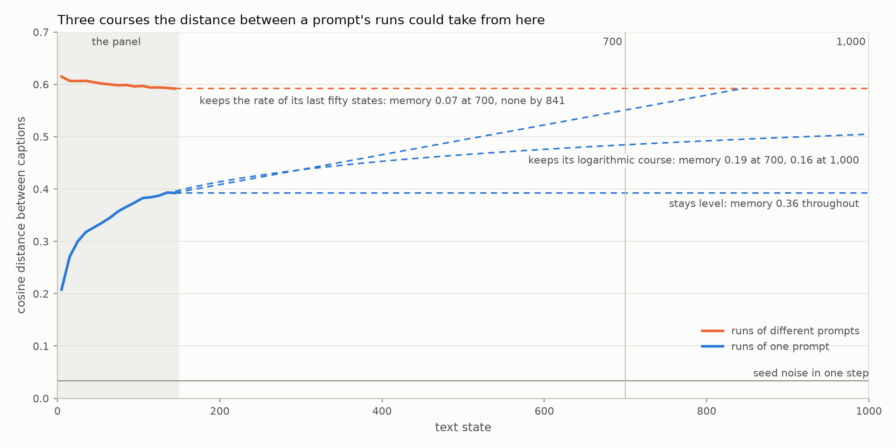

# Long follow-up design

The design for the experiment that asks whether a prompt is ever forgotten
(TASK-104), written 2026-10-04 from the panel's own data. The numbers come from
`analysis/follow_up_design.py` and `analysis/pd_cost.py`, with the JSON beside
each. Config: `config/long_follow_up_3x2_2000.json`.

Ben agreed the design on 2026-10-04, before any GPU time was spent on it.

## What the panel left open

TASK-103 read the panel (experiment `01a09e21`) as a prompt's position, a run's
own offset from it, and seed noise. On the twelve cells without Flux2Dev, the
two runs of a prompt end 0.39 apart and runs of different prompts 0.59. Memory
is the share of that gap still open. It has fallen from 0.71 to 0.36.

A run of 150 text states cannot say where the twin distance goes next. The
panel is consistent with three courses.

| Course | Memory at 700 | Memory at 1,000 | Twins as far apart as strangers |
| --- | --- | --- | --- |
| stays level | 0.36 | 0.36 | never |
| keeps its logarithmic course | 0.19 | 0.16 | near state 4,700 |
| keeps the rate of its last fifty states | 0.07 | none left | state 840 |

The panel supports the logarithmic course best. From state 20 on, the twin
distance has risen 0.039 each time a run doubled in length, with a
root-mean-square error of 0.003. A straight line over the same states has an
error of 0.007.

What counts as an answer is fixed here, before the run.

| Result | What the run shows |
| --- | --- |
| forgotten | the twin distance reaches the stranger distance |
| kept | the twin distance levels off below it, and displacement within one run climbs to the twin distance: a run has covered its prompt's region and the regions are still apart |
| not yet told | the twin distance is still rising and still short, which gives a rate and a lower bound |

## The design

| Choice | Value | What it is for |
| --- | --- | --- |
| prompts | five, one from each of the panel's five groups | covering the memory the panel measured, from 0.64 down to 0.10 |
| runs per prompt | eight | a prompt's centre seen from eight runs, where the panel inferred it from one pair |
| runs per cell | 40, in lockstep | the panel's batch of 40, so each captioner is defined as it was |
| cells | Moondream3 and Gemma4, each with Flux2Klein, SD35Medium and ZImageTurbo | the two captioners furthest apart, with every generator that is affordable |
| horizon | 1,000 text states (2,000 invocations) | 2.7 doublings past the panel, and past state 840, where the fastest course would bring twins to the stranger distance |
| everything else | as the panel | the first 150 text states can be set beside the panel's |

The six cells cost 20.2 GPU-days.

As in the panel, every text-to-image invocation draws and records its own seed.
Captioners decode greedily (decision-02) and nothing is truncated
(decision-01). The models are at their pinned revisions, and captions are
embedded with Qwen3Embed at 256 dimensions.

## Prompts

The panel's config lists its twenty prompts in five groups of four: objects,
arrangements of several things, people, events and abstractions. The follow-up
takes one prompt from each group.

| Prompt | Group | Memory, twelve cells | Memory, all sixteen |
| --- | --- | --- | --- |
| a red apple on a wooden table | objects | 0.64 | 0.64 |
| firefighters responding to a building fire | events | 0.55 | 0.52 |
| a train station with travellers carrying colourful luggage | arrangements | 0.44 | 0.40 |
| a man standing in a doorway | people | 0.24 | 0.24 |
| a city slowly turning into a forest | abstractions | 0.10 | 0.12 |

There are 1,024 ways to take one prompt from each group. This is the set whose
memories are spread most evenly, with no two neighbours closer than 0.09. The
spread is judged on the twelve cells and again on all sixteen, and a set scores
the worse of the two.

Judging it twice guards against noise. A prompt's figure is a mean over single
pairs, one from each cell, and on twelve cells it is uncertain by 0.05 to 0.11.
The two ends of the table are secure and the order of the middle three is
uncertain. The rule does not depend on that order.

The five are ordinary strangers to each other. At the end of the panel two of
them sit 0.59 apart on average, which is also the figure for any two of the
twenty. The ten pairs run from 0.53 to 0.66. As a set the five remember
slightly more than the panel's twenty, 0.40 against 0.36.

One of them is known to simplify. In SD35Medium + Gemma4, a run of the city
prompt reached a flat lime-green field at step 102. Such runs are counted
separately, as `panel-audit.md` counted them.

## Cells

| Cell | Memory at 150 in the panel | The same, these five prompts | GPU-days | Finished after |
| --- | --- | --- | --- | --- |
| Flux2Klein + Gemma4 | 0.40 | 0.41 | 2.3 | 2.3 days |
| SD35Medium + Moondream3 | 0.13 | 0.16 | 4.1 | 6.3 |
| ZImageTurbo + Moondream3 | 0.48 | 0.41 | 4.0 | 10.3 |
| Flux2Klein + Moondream3 | 0.25 | 0.26 | 3.1 | 13.4 |
| SD35Medium + Gemma4 | 0.30 | 0.32 | 3.4 | 16.8 |
| ZImageTurbo + Gemma4 | 0.36 | 0.34 | 3.4 | 20.2 |

Moondream3 and Gemma4 are the captioners furthest apart on what the panel
measured. Moondream3 writes the shortest captions, a median of 50 words, with
the least seed noise (0.027). Gemma4 writes the longest, 214 words, with the
most (0.046).

Each also does something the panel could only count as rare. Moondream3 runs
freeze on a caption: 1--5% of late steps repeat the one before. Two of the 120
Gemma4 runs in these cells slid into a flat field of colour. A run nearly seven
times as long will show whether either becomes common.

The three generators span what a step keeps: 0.012 with SD35Medium, 0.008 with
Flux2Klein and 0.006 with ZImageTurbo. Between them the six cells include the
lowest memory of the twelve and the highest, 0.13 and 0.48.

A cell is priced from the panel's own timestamps. One text state took a median
of 191 to 342 seconds of wall clock in these cells, and the panel's restarts
added 1.8%. Embedding and persistence diagrams follow once a cell's runs are
done, and take 37 to 56 minutes.

Cells run in the order of the table. The cheapest goes first, so the stages
that follow a cell are met at this length inside three days. Next come the two
cells at the ends of the panel's range, which are both in after ten days.

## Horizon

The twin distance has followed the logarithm of time, so what a longer run adds
is counted in doublings. From state 20 the panel covers 2.9 of them, and
running to 1,000 adds 2.7 more.

At 1,000 the level course leaves memory at 0.36 and the logarithmic course at
0.16. On the third course twins are as far apart as strangers by state 840, so
the run would watch a prompt forgotten. The standard error on one cell's memory
is 0.02 to 0.06, so a single cell can tell the three apart.

Displacement within a run can be followed out to a separation of 500 text
states, half the run. The panel's stopped at 70, where a run had covered
23--59% of the distance to its twin.

## What eight runs resolve

In the panel a prompt has one pair of runs in each cell. With the prompt's mean
and the cell's taken out, one pair's distance still varies by 0.16, against a
mean of 0.39.

Eight runs make 28 pairs. Their mean is uncertain by 0.03 to 0.08, depending on
how much of the variation belongs to single runs. For one prompt's memory in
one cell that is 0.05 to 0.14. For the five prompts of a cell together it is
0.02 to 0.06.

A cell still rests on 40 runs, the same number as a panel cell. The gain is
inside a prompt. Each prompt's twin distance is known two to five times better,
and its eight runs show whether they sit in one region or several.

## Launch

The run goes under `bin/long-run` as the unit
`panic-experiment@long_follow_up_3x2_2000`. The script's header comment covers
the unit, and it keeps the experiment's id and log under the config's name.

Two calls that follow a cell were sized for 150 text states. A persistence
diagram over 1,000 points takes 14--48 s, and Snex waits five by default. The
run would have failed at the end of its first cell. Both calls now allow for
the length of the run (`analysis/pd_cost.py`).

## What was priced and not chosen

| Alternative | GPU-days | Why not |
| --- | --- | --- |
| the same six cells to 700 text states | 14.1 | stops 140 states short of where the fastest course meets the strangers, and going on later would need an extension task that does not exist |
| all twelve affordable cells to 1,000 | 37.8 | the JoyCaption and Qwen25VL cells make a second batch of 17.6 days, better decided once the six are read |
| the three Moondream3 cells alone | 11.1 | one captioner, and the one whose runs freeze |
| one Flux2Dev cell | 21.0 to 27.3 | a single cell costs more than the six together |
